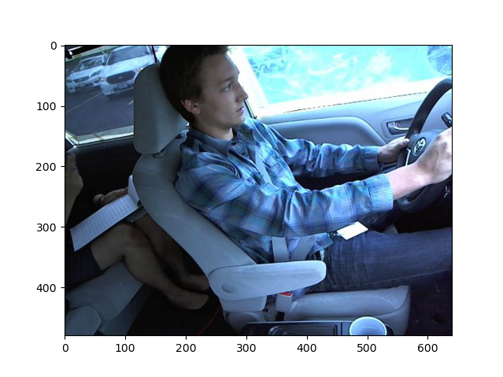
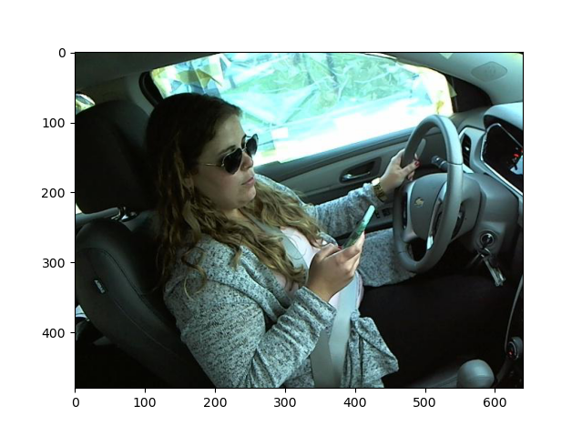
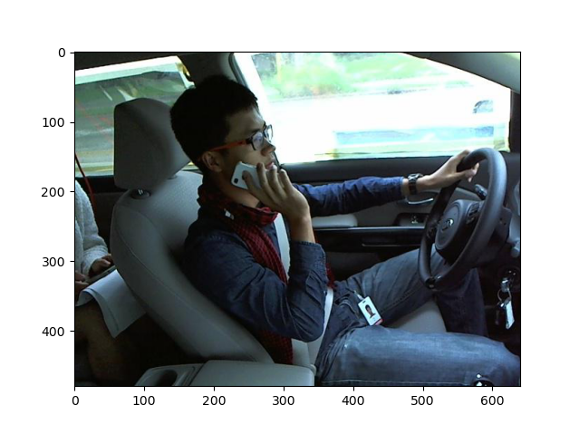
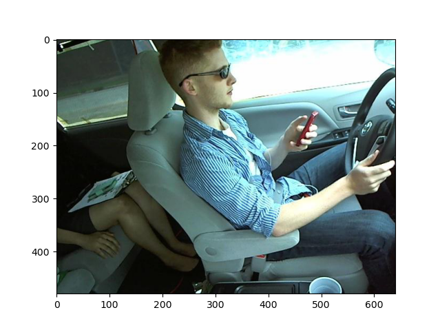
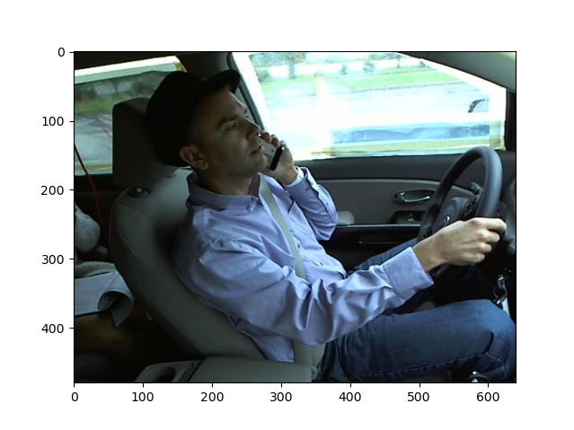
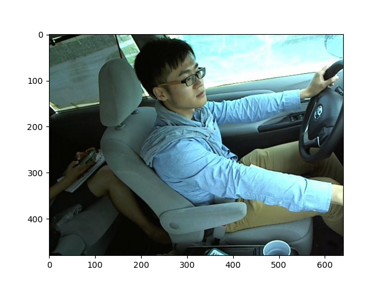
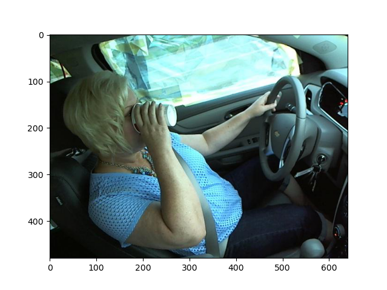
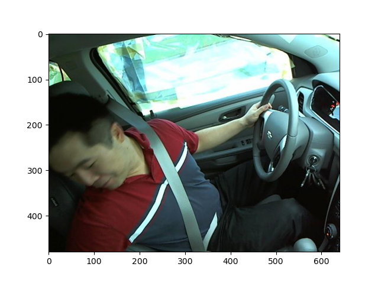
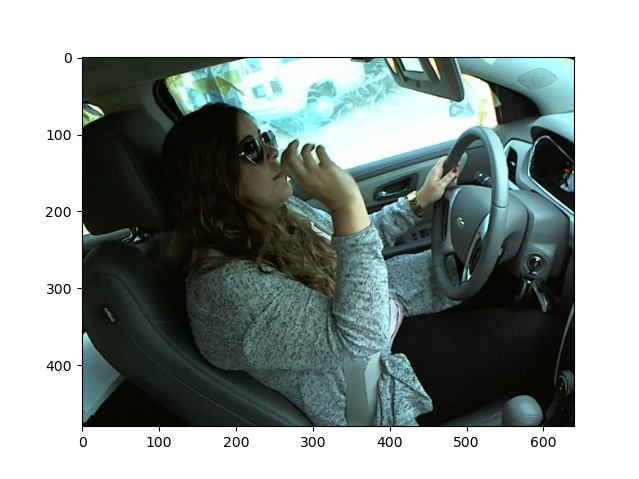
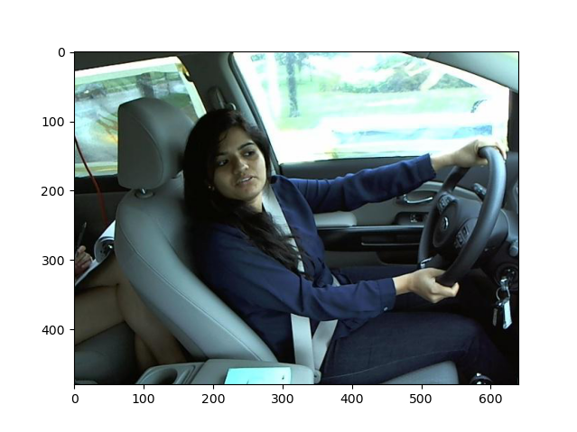

## Introduction
Distracted driving causes about 920,000 total accidents in the US per year according to the National Highway Transportation and Safety Administration (NHTSA) [1]. Experts in the fields of traffic safety and public health all concur that this is an underestimation of the dangers of distracted driving.

Prior work in this field includes a data augmentation method for distracted driving detection based on extracting relevant driving operation areas in the image as a preprocessing step using an R-CNN model [2]. The findings from this paper demonstrate the importance of doing operation area extraction in the preprocessing step, which can efficiently reduce redundant information in images and improve classification accuracy. An additional report in this field includes a distracted driving identification algorithm based on deep CNNs [3]. This approach coupled PCA with a multi-layer CNN to further improve performance.

In this project, we will use the State Farm Distracted Driver Detection dataset [4] to classify normal driving, texting, phone conversation, radio operation, drinking, reaching back, doing hair and makeup, and talking to passengers.
## Problem Definition
70% of fatal crashes are caused by unsafe driving behavior. Our project aims to preemptively identify such driving behavior in order to help prevent fatal accidents and adjust a driver’s habits.
## Data Collection
We chose to use the State Farm Distracted Driver Detection dataset, a collection of 22,424 images of drivers operating a vehicle [4]. Because labels were only provided for the training data, we split the training portion of the dataset into a new training set (80%) and test set (20%). An option was also included to shuffle the dataset before splitting, determining whether the test set will contain unseen individuals. To access items in the dataset, we grouped each image along with the ground truth label and person ID obtained from a csv file.

In order to avoid limitations imposed by the size of our dataset and improve generalizability, we chose to augment the data in several ways. Transformations included resizing, color jitter, rotation, random cropping, and normalization. All images were converted to grayscale to reduce the memory usage and to remove color information from the data. An edge detection filter was also applied, as the edges of each subject, and thus their pose and position, would provide the most relevant information.

Examples of images in the dataset and the class they belong to are shown below: 

 |  
:-------------------------:|:-------------------------:|
subject 016, Safe driving     |  subject 052, Texting - right    

  |    
:-------------------------:|:-------------------------:
subject 026, Talking on the phone - right   |    subject 015, Texting - left

 | 
:-------------------------:|:-------------------------:|
subject 024, Talking on the phone - left      |    subject 012, Operating the radio  

 | 
:-------------------------:|:-------------------------:
subject 042, Drinking   |   subject 035, Reaching behind

  |  
:-------------------------:|:-------------------------:|
subject 052, Hair and makeup  |   subject 022, Talking to passenger

## Methods
### Unsupervised methods
#### PCA
The processed dataset still has a very large number of features, so principal component analysis (PCA) was performed to further reduce the dimensionality of the dataset and extract the most relevant features that maximize the variance in the data. This effectively performs compression on each image and subsequently reduces the computation and memory requirements for training models on the data. To further reduce memory requirements, the IncrementalPCA method in sklearn was used to incrementally fit the PCA components on batches of data. A graph of the explained variance ratio was generated, and a suitable number of components was chosen to balance capturing as much variance as possible while making the memory requirements feasible.

A transformed set of features was then fit using the training data. For testing, the same transformation was applied to the testing set. The sklearn PCA library performs the normalization of the data, and because each feature is a pixel value, they are already on the same scale, and the input to PCA is thus well-formed.
#### Autoencoder
As an alternative to PCA, a convolutional autoencoder was used to compress the image and reduce the data to a lower dimension feature representation. The autoencoder consisted of an encoder and decoder, which each were composed of mirrored sequences of convolutional layers with leaky ReLU activation functions. The final layer in the encoder and first layer in the decoder consisted of a flattened dense layer that determined the number of features in the resulting encoded feature representation. At a vector length of 1000, the final autoencoder consisted of approximately 24.6 million parameters. 

To improve the convergence of the autoencoder, the input images were normalized to a mean and standard deviation of (0.5, 0.5, 0.5). The autoencoder itself was trained using the Adam optimizer with a learning rate of 5e-4 and a batch size of 64 for 10 epochs. 
#### K-means
A K-means model was used as an unsupervised clustering method. For a given number of clusters k, a model was fit using the training data. Then, each cluster was associated with one of the ten ground truth labels by giving the cluster the same label as the highest occurring category in that cluster. Thus, an arbitrary number of k clusters can be used to classify images as one of the ten actual labels. Once fit, the model can be used to classify images in the testing set. To select an optimal number of clusters, an elbow plot was generated, plotting the model accuracy against the number of clusters and selecting a k value at the “elbow” of the curve.

### Supervised Methods
#### Support Vector Machines
For experiments with support vector machines, the unshuffled and shuffled dataset was trained and fitted with a linear SVM and a 3rd degree polynomial kernel. Brief experimentation was also done using a radial basis function (RBF) kernel. The dataset has been preprocessed to grayscale with edge detection. Once fitted, we classify the images in the testing set.

#### Convolutional Neural Networks

Several architectures were implemented and evaluated in an attempt to classify the images. Our chosen architectures were ResNet, VGG16, EfficientNet-B4, and a custom CNN architecture. In order to prevent overfitting the data with such large models, several forms of regularization were used. The images were augmented by randomly changing the brightness, contrast, saturation, and hue of the image, and were randomly cropped and rotated. Additionally, a weight decay was introduced to punish the magnitude of the learned weights, and a dropout layer was added between the linear layers so that the model was not dependent on specific features, making it more robust and capable of generalization.

## Results and Discussion
#### PCA
For the un-augmented dataset, a number of reduced features of approximately 250 appears to capture a sufficient amount of variance in the data before the explained variance curve begins to flatten and the marginal increase in variance of each additional component gets lower and lower.

An example of performing the transformation to compress the image is shown below.

For a dataset with augmentations, however, the required number of features to achieve the same explained variance ratio increases dramatically. This is because the variation across images in the dataset has increased. This is especially true with augmentations that perform geometric transformations on the images such as a translation, crop, or rotation, causing shapes and edges in the images to shift their locations. Because PCA is dependent on the “locality” of the dataset, transformations that affect these locality relationships will also affect the performance of PCA.

A similar reason can be used to explain differences in the performance of PCA depending on if the subjects are shuffled in the dataset prior to the train-test split. By qualitative analysis, the results of applying the transformation on the test images vary dramatically. An example of the PCA transformation when the data is shuffled is shown below,

 
while an example of the PCA transformation when the data is not shuffled is shown here.

 
The PCA components have been fit on the specific subjects in the training set and thus fail to capture the geometric differences in the images given new subjects in the test set.
#### Autoencoder
A similar phenomenon occurs when using the autoencoder, as it also poorly generalizes to subjects that are not seen in the training dataset. For example, a reconstructed image when the subjects are shuffled initially is shown below,

while an example of a reconstructed image when the data is not shuffle is shown here.

As with using PCA, the reconstructed images on the test dataset look qualitatively worse; they are much more blurry, and details relevant to the action taken such as the driver’s arm position and face orientation are difficult to perceive. Accordingly, the poor performance of the autoencoder can be attributed to the same causes that result in the poor performance of using PCA. The autoencoder has likely overfit to the training data, which contains images that differ in respects such as the color, camera angle, and general body position of each subject.

#### K-means
The differences from shuffling and not shuffling the subjects in the dataset also affect the performance of the k-means clustering. When the subjects are shuffled, and PCA is used to reduce the number of features, k-means with k=300 achieves a testing accuracy of nearly 90%.

The confusion matrix of the model’s performance shows that it generally captures all ten labels in the test set accurately, without any noticeable bias for one particular category.

 

 
A similarly high accuracy of nearly 90% is achieved when using the autoencoder on the pre-shuffled dataset and k=450.

 
Again, the confusion matrix demonstrates that the model generally captures every label accurately.

 
Notably, however, the confusion matrices illustrate a higher degree of misclassification occurring between pairs of labels, such as labels 3 and 4 in the matrix shown above. These two labels in particular correspond to “Texting - left” and “Talking on the phone - left”, which are compared below.
 
  |    
:-------------------------:|:-------------------------:
subject 026, Texting - left   |    subject 015, Talking on the phone - left
 
There is a higher degree of similarity between the images in this pair of labels relative to all other labels; the subjects are sitting in similar body postures, with the only difference being the position of their left arm. This may explain some of the “paired misclassifications” found in the confusion matrix. A similar analysis can be made for the pair “Texting - right” and “Talking on the phone - right”.
 
Since the data is fairly evenly distributed amongst the classes, we can use any of macro, micro, or weighted averaging for the metrics and still receive similar numbers. Listed below are the accuracy as well as the F1 score, precision, and recall using a weighted average across the one-vs-rest heuristic for multi-class classification.
 
||Training|Testing|
|Accuracy|0.8922|0.8855|
|Precision|0.8930|0.8873|
|Recall|0.8928|0.8883|
|F1|0.8911|0.8857|
 
The sum of the incorrect predictions per column correspond to the false positives, which impact the precision. The sum of the incorrect predictions per row correspond to the false negatives, which impact the recall. We can see that the incorrect predictions for rows and columns are fairly similar, which leads to having a similar precision and recall value. Since the F1 score is a harmonic mean between the precision and recall, it is also very close to those values.
 
However, the model performs far worse if the data is not shuffled, and subjects are withheld in the testing set. The resulting elbow plot for k-means when PCA was applied is shown below.

As shown by the confusion matrix, the model essentially assigns all of the images to a subset of the labels, achieving an accuracy of around 10%, which is the same performance as random guessing.

 
||Training|Testing|
|Accuracy|0.8506|0.1091|
|Precision|0.8535|0.0697|
|Recall|0.8485|0.1166|
|F1|0.8485|0.0521|
 
The poor performance of the PCA transformation on the unshuffled dataset, as shown above, can also explain the poor performance in the k-means model. The geometric dissimilarities caused by different subjects appearing in the testing set also cause the k-means clusters to fail to classify new images with unseen subjects.
 
With a combination of augmentations applied to the images, the resulting performance of PCA and k-means clustering on the test set when subjects are withheld does not appear to improve. This suggests that the models are too reliant on and overfitting to specific subjects appearing in the training data and fail to generalize to new subjects. 
 
Again, similar poor performance is seen when the autoencoder is used instead of PCA to produce reduced dimension inputs to the k-means model. In this instance, the model achieved a test accuracy of about 15%, but the confusion matrix still illustrates an inability to reliably delineate between classes.

 
 
#### Support Vector Machines

Linear
The linear SVM was set to solve for primal optimization for both shuffled and unshuffled data. Training takes around four minutes in our machine. Below is the confusion matrix, accuracy and F1 score for shuffled data:

Training data:

Train Accuracy (Linear):  100.00

Train F1 (Linear):  100.00

Test set:

Test Accuracy (Linear):  99.42

Test F1 (Linear):  99.42

While the results are very good in the case of shuffled data, the unshuffled data suffers the same performance problems as k-means.

Below is the confusion matrix, accuracy and F1 score for unshuffled data:

Training data:

Train Accuracy (Linear):  100.00

Train F1 (Linear):  100.00

Test data:

Test Accuracy (Linear):  17.43

Test F1 (Linear):  12.87

The training accuracy is still very good, but the test accuracy is no better than random guessing. This indicates that the model still has problems generalizing to new subjects. We experimented with regularization by changing the C hyperparameter, but the results are similar.

3rd Degree Polynomial
Training with the polynomial kernel takes about 20 minutes. No regularization was used. Below is the confusion matrix, accuracy and F1 score for shuffled data:

Training data:

Train Accuracy (Polynomial Kernel):  99.99

Train F1 (Polynomial Kernel):  99.99

Test set:

Test Accuracy (Polynomial Kernel):  99.91

Test F1 (Polynomial Kernel):  99.91

The same issues are seen with the 3rd degree polynomial kernel as the linear SVM with generalization.

Below is the confusion matrix, accuracy and F1 score for unshuffled data:

Training data:

Train Accuracy (Polynomial Kernel):  99.99

Train F1 (Polynomial Kernel):  99.99

Test set:

Test Accuracy (Polynomial Kernel):  13.56

Test F1 (Polynomial Kernel):  7.53

Radial Basis Function (RBF)
For the test with the RBF kernel, the SVM was ran with the following hyperparameters:

Gamma = 1.0
C = 0.2

Gamma defines the influence of each training sample on the support vectors. It has an inverse relationship, the higher the gamma, the less influence of each sample. C is the regularization parameter.

Training of the SVM with the RBF kernel took 1+hr and the results did not look promising, so no further experimentation was done. The accuracy and F1 score for the model with unshuffled data is shown below:

Training Accuracy:  10.96

Test Accuracy:  11.62

Training F1:  2.17

Test F1:  2.42
#### Convolutional Neural Networks

ResNet-18 was first evaluated on the shuffled dataset, and a validation accuracy of 98.5% was achieved.

 

ResNet-18
 
Shuffled Subjects
 
LR = 5e-3 | Weight Decay = 0
 
Train Accuracy = 99.6% | Validation Accuracy = 98.5%

 

Confusion matrix for shuffled subjects
 
The same model was then applied to the unshuffled dataset, with the convolutional layers frozen to decrease the computational intensity of backpropagation and decrease training time.

ResNet-18, Frozen Convolutional Layers
Unshuffled Subjects
LR = 1e-3 | Weight Decay = 1e-4
Train Accuracy = 76.7% | Validation Accuracy = 37.9%
 
The convolutional layers were then unfrozen and a validation accuracy of 71.6% was achieved.

ResNet-18
Unshuffled Subjects
LR = 5e-4 | Weight Decay = 5e-2
Train Accuracy = 99.7% | Validation Accuracy = 71.6%
 
 
 

ResNet-152
Unshuffled Subjects
LR = 1e-3 | Weight Decay = 5e-3
Train Accuracy = 99.7% | Validation Accuracy = 74.0%
 
 

Confusion matrix for unshuffled subjects
 
EfficientNet-B4, an architecture with state-of-the-art performance on image classification benchmarks such as ImageNet with only 19 million parameters, was chosen next, achieving a validation accuracy of 77.3%

EfficientNet-B4
Unshuffled Subjects
LR = 1e-2 | Weight Decay = 2.5e-3
Train Accuracy = 98.9% | Validation Accuracy = 77.3%
 
## Conclusion
This project aimed to develop machine learning models to identify distracted driving behavior. Such a tool could be used as part of a system that monitors drivers and preemptively warns them if they are being distracted, keeping their focus on the road and improving their safety. The dataset itself consisted of still images of a number of subjects performing one of ten actions while driving. One category included drivers focused on the road, while the other nine were considered distracted driving behaviors. A number of unsupervised and supervised methods were tested in an attempt to classify each image against one of the ten labels. Notably, splitting the dataset into training and testing involved a decision on whether or not to shuffle it beforehand. If it were shuffled, then the training and testing set would contain a mix of all of the subjects present in the dataset. Otherwise, the training and testing set would contain distinct subjects. Testing the models’ performance on this unshuffled dataset would be more informative, because it would demonstrate the model’s ability to generalize well for unknown subjects. Realistically, this would be required of a driver monitoring system, which would be trained on an existing dataset and then used on a newer, potentially more varied population in commercial use.

Overall, the CNN model performed the best, achieving a test accuracy of around 77%. All other models saw much worse performance, with no other model reaching an accuracy above 20%. When subjects are withheld from the training data, the overall poor performance of many of the methods suggests that the models are overfitting and failing to generalize to new subjects. This reasoning is supported by the fact that the dataset itself only has fewer than 70 unique subjects, so new subjects in the testing set likely introduce new shapes and features that would cause the model to perform poorly.

Similar results were observed in the supervised methods, with both SVM and CNNs achieving a 99% validation accuracy on the shuffled dataset, but performing significantly worse on the unshuffled dataset. This can again be attributed to the lack of test subjects. Although large CNN models such as ResNet-152 were certainly able to capture and characterize the complexity of the dataset, they were not able to successfully generalize to a satisfactory level.

One main area of future work involves developing methods that allow the models to generalize well to unseen subjects. This issue may involve extracting subject-agnostic features from the images prior to performing clustering or classification. This may be accomplished by extracting relevant features of the images via unsupervised segmentation or a pre-trained neural network performing semantic segmentation. Additionally, improving the dataset by expanding it to include a wider breadth of subjects may improve performance. This also mitigates any potential biases on specific populations of people that could arise from a limited dataset such as the one used in this project.

One other avenue for future work involves improving the types of machine learning models used. Because behaviors involve a temporal component, models that can reason temporally using a series of images or video data may be more suitable to this particular application. Other methods may incorporate multiple modes of data, such as incorporating data from the driver’s phone.

Restate questions from introduction 
Restate important results 
Generalization is hard
Augmentation is good
Regularization is good
Unsupervised doesn’t work as well
Dataset is just as important as the method
Classes are very complex/nuanced
Include any recommendations for additional data as needed // future direction for the project 
Binary classification (safe driving vs not safe driving) 

## References
[1] S. Coleman, “Distracted driving statistics 2022,” Bankrate, 07-Sep-2021. [Online]. Available: https://www.bankrate.com/insurance/car/distracted-driving-statistics/. [Accessed: 24-Feb-2022].

[2] J. Wang, Z. Wu, F. Li, and J. Zhang, “A Data Augmentation Approach to Distracted Driving Detection,” Future Internet, vol. 13, no. 1, p. 1, Dec. 2020, doi: 10.3390/fi13010001.

[3] Rao, X., Lin, F., Chen, Z. et al. Distracted driving recognition method based on deep convolutional neural network. J Ambient Intell Human Comput 12, 193–200 (2021). https://doi.org/10.1007/s12652-019-01597-4

[4] State Farm Distracted Driver Detection, Kaggle, 2016. Accessed on: Feb. 24, 2022. [Online]. Available: https://www.kaggle.com/c/state-farm-distracted-driver-detection/overview

[5] D. Feng and Y. Yue, “Machine Learning Techniques for Distracted Driver Detection,” CS 229: Machine Learning, 2019. [Online]. Available: http://cs229.stanford.edu/proj2019spr/report/24.pdf. [Accessed: 23-Feb-2022].

[6] M. H. Alkinani, W. Z. Khan and Q. Arshad, “Detecting Human Driver Inattentive and Aggressive Driving Behavior Using Deep Learning: Recent Advances, Requirements and Open Challenges,” in IEEE Access, vol. 8, pp. 105008-105030, 2020, doi: 10.1109/ACCESS.2020.2999829.

## Video 
<iframe width="560" height="315" src="https://www.youtube.com/embed/X3aVDufNLig" frameborder="0" allow="autoplay; encrypted-media" allowfullscreen></iframe>

